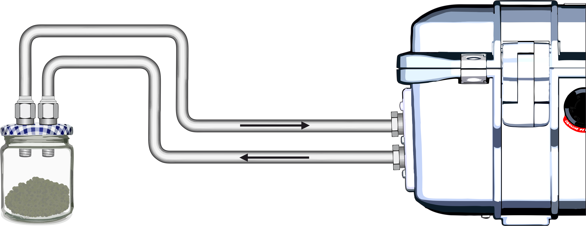

<style type="text/css">
.caption {
    font-size: x-small;
}
</style>

```{r options, include=FALSE}
knitr::opts_chunk$set(echo = F)

```

# Incubation set up

To measure greenhouse gas emissions, namely $CO_2$ and $CH_4$ from soil samples, we are using an unconventional incubation set up, that allows us to follow gas production rates as they are produced in a very high resolution. We use a [LICOR trace gas analyzer](https://www.licor.com/env/products/trace_gas/LI-7810), which is directly connected to the jar containing the soil sample (figure \@ref(fig:scheme)).


```{r scheme, fig.cap = "Measurement set up: a glas jar containing the soil sample that is incubated is connected to a trace gas analyzer", fig.align='center', out.width = '50%'}



```


With this set up, we obtain high resolution measurements, which are much more reliable compared to manual samples, where only two samples are taken: One in the beginning of enclosure time and one at the end (which, for sure gives a beautiful linear regression). With our set up we obtain a continuous measurement series with a resolution of $\frac{1}{sec}$, for the whole enclosure time (figure \@ref(fig:measured)). However, one obstacle is that we actually don't see a linear increase: In the beginning of the measurement the slope is much higher than after ca. 9 minutes.

```{r data, include=FALSE}
library(tidyverse)

header1 <- scan("./input/Honey_jar_vs_big_jar-2021-04-08.data", skip = 5, nlines = 1, what = character())
header2 <- scan(file = "./input/Honey_jar_vs_big_jar-2021-04-08.data", sep = '\t', skip = 6, nlines = 1, what = "", na.strings = "")
header <- paste0(header1,  sep = "_", header2)
rm(header1, header2)

HvsB <- read_tsv("./input/Honey_jar_vs_big_jar-2021-04-08.data", skip = 7, col_names = FALSE)
attr(HvsB, "spec") <- NULL #remove -attr- WHAT are those even?
colnames(HvsB)<-header
rm(header)

#combine date and time in one column
HvsB$Date_Time <- as.POSIXct(paste(HvsB$DATE_date, HvsB$TIME_time), format="%Y-%m-%d %H:%M:%S")
# Sii_81_20g in Honey Jar (220ml)
HJ_a <-HvsB  %>% filter(as.character(TIME_time) > "15:50:00" & as.character(TIME_time) < "16:31:00")
HJ_a$DiffTime <-round(difftime(HJ_a$Date_Time, HJ_a$Date_Time[1]), 3)
rm(HvsB)


# correct format
HJ_a$DiffTime <- as.numeric(HJ_a$DiffTime)
HJ_a$CO2_ppm <- as.numeric(HJ_a$CO2_ppm)

```

```{r measured, message=FALSE, warning=FALSE, fig.cap = "Single measurement of $CO_2$ concentration with fittet linear regression for ther first 9 minutes (white) and after the first 9 minutes (lila).", fig.align='center', out.width = '50%'}


frst <- lm(CO2_ppm~DiffTime, data=HJ_a %>% filter(DiffTime <= 9*60 ))
scnd <- lm(CO2_ppm~DiffTime, data=HJ_a %>% filter(DiffTime >= 9*60 ))

library(ggplot2)
lm<-HJ_a %>%
  ggplot( aes(x=DiffTime, y=CO2_ppm)) +
  geom_line(color="black", size=0.6) +
  #ggtitle("CO2 flux during a single measurement") +
  ylab("CO2 in [ppm]") +
  xlab('time in [sec]')+
  theme_minimal()+
  theme(
    panel.grid.minor.y = element_blank(),
    panel.grid.major.y = element_blank(),
    panel.grid.major = element_blank(),
    panel.grid.minor = element_blank(),
    axis.text = element_text( size= 12),
    axis.title=element_text(size=14),
    axis.text.y = element_text(colour = "black"),
    axis.text.x = element_text(colour = "black"),
    panel.background = element_rect(fill='#e1dfed'),
    plot.background = element_rect(fill = "transparent",colour = NA),
    panel.border = element_rect(colour = "black", size=1, fill = NA),
    axis.ticks = element_line()
  ) +
  ylim(535, 594)+
  xlim(0, 2460)+
  annotate("rect",
           xmin = -Inf, xmax = 9*60, 
           ymin = -Inf, ymax = Inf,  fill = "white", alpha=.5)+
  geom_abline(intercept = frst$coefficients[1], slope = frst$coefficients[2], lwd=1, col='#ffffff')+
  geom_abline(intercept = scnd$coefficients[1], slope = scnd$coefficients[2], lwd=1, col='#9B8FDF')


lm 
 
```

Let's look at the linear model in more detail, by producing a linear model for every 3 minutes of the measurement (black line in figure \@ref(fig:measured)). Slope and intercept of all these models are shown in figure \@ref(fig:linearmodel): The first model (no.1 in the y-axis) is the linear regression for the first 3 minutes, the 2nd for minute 3 to 6 and so on. On the x-axes intercept (left) and slope (right) of each model are plotted together with standard deviation. The slope is decreasing in the first minutes, but after a certain time it stays stable (at around 0.021). This is the actual slope we are interested in. YAY!

But why is the slope different in the beginning? 
The blame is on Henry and his law.

```{r linearmodel, echo=FALSE,  message=FALSE, warning=FALSE,  fig.cap = "Linear model for every 3 minutes of $CO_2$ measured in a single measurement.", fig.align='center', out.width = '50%'}

library(nlme)
lin_regr <- function(data, dt){
  time_s = round(difftime(data$Date_Time, data$Date_Time[1]), 3)
  steps = seq(0, as.numeric(max(time_s)), by = dt)
  grp = rep(1:length(steps), each=dt)
  grp = head(grp, -(length(grp)-length(time_s)))
  CO2_ppm = data$CO2_ppm
  input <- data.frame(grp, CO2_ppm, time_s)
  flm <- lmList(CO2_ppm ~ time_s | grp, input)
  return(flm)
}

flm_HJ_a <- lin_regr(data=HJ_a, dt=180)
plot(intervals(flm_HJ_a))
```


# Henry's Law

The [Law of Henry](http://satellite.mpic.de/henry/) describes the solubility of gases in water [@sander_compilation_2015]. If you have a bottle of sparkling soda and you open it up, the dissolved $CO_2$ is gassing out until the Henry-equilibrium between the water and the gas phase above the water (so, the air in the room) is reached: most of the $CO_2$ in your soda will be in the atmosphere around you- but not all of it. A certain amount of $CO_2$ will stay dissolved in the water. If you want to know how much $CO_2$ is still in the water, you can ask Henry.

Thus, we can apply Henry's law to understand the non-linear increase in the beginning of our incubation measurement: As the amount of $CO_2$ in the incubator can be different from the $CO_2$ amount in the lab, where we are measuring, the aqueous phase in the sample newly equilibrates to a different $CO_2$ concentration (like, when you open the soda bottle). If the $CO_2$ concentration in the Incubator was higher than in the lab, $CO_2$ gasses out (as seen above with the higher slope in the measurement). If the $CO_2$ concentration in the incubator was lower, $CO_2$ is dissolved in the aqueous phase of the sample (so the slope in the beginning is lower- it can even be negative).

But the most interesting thing is not the final **equilibrium**, but the **time it takes to reach** it. (like, how long does it take for your soda to have no sparkles any more). This depends mainly on the size of the interface at which $CO_2$ can "travel" between water- and gasphase (do you have your sparkling soda in a wide glass or in a champaign glass?- do you stir it?).
To know this rate, we can model the process and fit the model to the measurement curve above.

Let's model it:


## get the equations:

So, **microbial activity** produces $CO_2$ from soil carbon with the rate **k1**. Other than presumed above, the $CO_2$ will not directly be released into the gas phase, but will dilute in the aqueous phase:

$$C  \rightarrow  CO_{2 (aq)}$$ 

In the aqueous phase $CO_2$ will outgas at the rate of **kh1** to the gas phase:

$$CO_{2 (aq)} \xrightarrow{kh1} CO_{2 (g)}$$

But $CO_2$ in the gas phase will, as well, dilute in the aqueous phase at the rate **kh2**:

$$CO_{2 (g)} \xrightarrow{kh2} CO_{2 (aq)}$$


The ratio of the two rate constants **kh1** and **kh2** is described by Henry's Law : $$K_H = \frac{kh1}{kh2}$$

Here we use the dimensionless Henry constant, which uses the amount of $CO_2$ in the gas phase divided by the amount of $CO_2$ in the aqueous phase both in $\frac{mol}{l}$.

$$K_H = \frac{c_g}{c_{aq}}= \frac{kh1}{kh2}= 1.186$$ 

The rate constants **kh1** and **kh2** depend on how fast the $CO_2$ is transported to the gas-liquid phase boundary. When stirring, the rate constant **kh1** is higher and $CO_2$ outgases faster, and also dilutes faster into the liquid phase (**kh2** is then higher too). The ratio of both stays constant at $K_H$.


## Implement 

Now the processes described above are implemented, as a system of differential equations **CHenry**. With the degradation of C in the soil $\frac{dC}{dt}$:

$$ \frac{dC}{dt} = - k1 \cdot C $$

The amount of $CO_2$ dissolved in soil water $\frac{dCO_{2(aq)}}{dt}$, produced by microbial activity $k1 \cdot C$ and the $CO_2$ dissolving in the water phase from the gas phase $kh2 \cdot CO_{2(g)}$:

$$\frac{dCO_{2(aq)}}{dt} = k1 \cdot C - kh1 \cdot CO_{2(aq)} + kh2 \cdot CO_{2(g)}$$

And the $CO_2$ in the gas phase $\frac{dCO_{2(g)}}{dt}$ outgassing from the water phase $kh1 \cdot CO_{2(aq)}$. The ratio $\frac{V_w}{V_g}$ accounts for the fact, that the volume of the liquid reservoir is different from the gas reservoir, so that the *concentration* change is different when a $CO_2$ molecule passes the phase boundary.

$$\frac{dCO_{2(g)}}{dt} = \frac{V_w}{V_g} \cdot \left( kh1 \cdot CO_{2(aq)}  - kh2 \cdot CO_{2(g)} \right)$$

These differential equations can then be solved with the `ode()` function from the package `deSolve` in a wrapper function:

```{r henry , echo=TRUE}

# S - C amount in Soil [mol/l]
# W -CO2 in the Water [mol/l]
# G - CO2 in The Gasphase [mol/l]

# k1 - microbial degradation rate [1/s]
# kh1  speed of CO2 going from W to G []
# kh2 - kh1/KH -speed of CO2 going from G to W []

# V_w - volume of water phase [l]
# V_g - volume of gas phase [l]

# t - modelled time [s]

library(deSolve)
KH=1.186
CHenry<-function(t, Cstart, rate) {
  with(as.list(c(Cstart, rate)),{
    # rate of change
    dS <- -k1*S                   
    dW <-  k1*S - kh1*W + (kh1/KH)*G
    dG <-         kh1*(V_w/V_g)*W - (kh1/KH)*(V_w/V_g)*G
    # return the rate of change
    list(c(dS, dW, dG))
  })   # end with(as.list ...
}
 
```

In the next step we can write a wrapper- function that includes **CHenry** and all the input variables.

```{r function, echo=TRUE}

wrapperCmess = function(time, S, W, G, k1, kh1, V_w, V_g){
  time = time
  Cstart = c(S=S, W=W, G=G)
  rate = c(k1=k1, kh1=kh1, kh2=kh1/KH)
  result = as.data.frame(ode(func=CHenry, y=Cstart, parms=rate, times=time))
  result$time_h = result$time/3600
  result$G_ppm = (result$G *1000*R*Temp) / (101325 *1e-6)
  result$hypW_ppm = (result$W * (V_w/V_g)*1000*R*Temp) / (101325 *1e-6) # hypothetical value, if all CO2 outgases to gas phase
  return(result)
}

```


# Incubation Model

Define the input values:

```{r input, echo=TRUE}

# 1 day in sec [s]
day=24*60*60 

# general gas constant [(kg * m²)/(s² * mol * K)]
R = 8.31446261815324

# temperature [K]
Temp = 298 


# microbial activity ---------------
m = 1.02 # microbial degradation rate [mg(CO2) / g(Soil) day]

P_TOC = 0.45  # TOC-content of Soil sample [%]

k1 =  (m * 1e-3 * 12/44 *1/P_TOC) * 1/day # degradation per sec [1/s] 
tau = 1/k1 *1/day #degradation per day  [days]

# Gas volume of measurement set up
V_g = 0.22 # [l]

# Soil Sample------------------------------
P = 20        # Soil sample [g]
P_w = 0.9     # Water content [%]
P_TOC = 0.4  # TOC-content of Soil sample [%]

W = P*P_w         # total amont of water [g]
V_w = W / 1000    # Volume of water [l]

C_g = P * (1-P_w)      # dry Soil sample [g]
C = C_g*P_TOC/12/V_w   # degradable Carbon [mol/l]

# CO2 production rate [ppm/s]
#(C*1000*k1*R*Temp *(V_w/V_g))/(101325 *1e-6)


# CO2 amounts ---------------

ppm_g = 450 # CO2 in the gas-phase [ppm]
G = (ppm_g *1e-6*101325)/(R*Temp*1000)  # CO2 in gas [mol/l]

ppm_w = 450 # water phase eqilibrate to atmospheric CO2 in [ppm]
W=((ppm_w *1e-6*101325)/(R*Temp*1000))/KH # CO2 in the water [mol/l]


C_ges_sys_mol = C*V_w + W*V_w + G*V_g   # total C-CO2 in the system [mol]

# Henry constant dimensionless
KH =1.186

# degas rate ------------
kh1 = 0.01
 

 
```

Now run the model with the parameters above for 30 minutes. The green dashed line is what we can measure in our experiment. In the model we can also see the amount of $CO_2$ dissolved in the soil aqueous phase.
The yellow line in figure \@ref(fig:show) is the ratio of the $CO_2$ amount in the gas and in the aqueous phase: after the first few minutes, it is nearly stable, because a equilibrium is nearly reached. The slow linear increase after 500 seconds is due to the microbial $CO_2$ production unsettling the equilibrium by constantly increasing the $CO_2$ concentration in the liquid phase an thereby in the whole system.

```{r run, echo=TRUE, out.width = '50%'}
# 30 minutes --------
t=30*60
Cmess <- wrapperCmess(time=seq(0, t, by = t/10000),S=C, W=W, G=G, k1=k1, kh1=kh1, V_w =V_w, V_g= V_g)
```

```{r show, fig.cap = "Modelled output for 30 minutes. $CO_2$ concentration in the gas phase (green dashed line), $CO_2$ concentration in the liquid phase (green line), Concentration ratio of $CO_2$ in the gas and in the liquid phase (yellow line, left axis).", fig.align='center', out.width = '80%'}

# plot mol/l----------------
par(mar=c(5,5,3,4))
plot(G~time, data = Cmess, ylim=c(1.5e-5, 2.02e-5),
     #main ='approaching the Henry equilibrium in 30 min',
     xlab = 'Time [s]', ylab = 'CO2[mol/l]', 
     cex.lab = 1,  
     col = 'seagreen3',
     lwd = 2, 
     lty = 5,
     type='l')
lines(W~time, data = Cmess, col = 'seagreen', lty = 1, lwd = 2)


par(new=TRUE)
plot(G/W~time, data = Cmess, ylim =c(0.8, 1.186), xlab ='', ylab='',xaxt='n', yaxt='n', 
     col = 'orange', lty = 1, type='l',
     lwd = 2)
axis(side= 4)
mtext('concentration ratio', side =4, line =3, cex=1)

legend('bottomright', bty = 'n', legend = c('CO2 in gas phase', 'CO2 in the liquid phase', 'ratio of C_g/C_w'), 
       col = c('seagreen3', 'seagreen', 'orange'), cex=0.8, lty = c(5,1,1))


 
 
```


## Find the Fit

Now that we have the model we can also fit it to the measured data: by adjusting the input variable for the 

- amount of $CO_2$ in the incubator (aqueous phase is equilibrated to)
- rate at which the microbes degrade the carbon in the soil
- the diffusion rate between aqueous and gas phase.

You can give it a try here:

```{r ui}
library(shiny)
#time, S, W, G, k1, kh1, V_w, V_g
ui <- fluidPage(
                headerPanel("Incubating wet soil samples: Henry's Law Modell"),
                sidebarLayout(
                  sidebarPanel(
                    h3("Incubator"),
                    numericInput("ppm_a", label = "CO2 concentration [ppm]",
                                 min = 50, max = 10000,  
                                 value = 60, step = 50, width=200),
                    
                    h3("rate-constants"),
                    numericInput("m", label = "microbial degradations-rate[mg(CO2) / g(Soil) day]",
                                 min = 0, max = 1, 
                                 value = 0.8, step = 0.005, width=200),
                    numericInput("kh1", label = "rate of CO2 diffusion between aqueous and gas phase",
                                 min = 0.001, max = 0.1,  
                                 value = 0.04, step = 0.002, width=200),
                  
                    width = 3
                  ),
                  mainPanel(
                    plotOutput("CconcPlot", height = "600px")
                    )
                 )
              )

 
```


```{r server}
#time, S, W, G, k1, kh1, V_w, V_g
t= 2500
server <- function(input, output) {
  output$CconcPlot <- renderPlot({
    dfConc = wrapperCmess(time=seq(0, t, by = t/10000),
                        S=C,
                        W=((input$ppm_a *1e-6*101325)/(R*298*1000))/KH, 
                        G=(537 *1e-6*101325)/(R*298*1000),
                        k1=(input$m * 1e-3 * 12/44 *1/P_TOC) * 1/day, 
                        kh1=input$kh1,
                        V_w=V_w,
                        V_g=V_g)
    plot(CO2_ppm~DiffTime, data=HJ_a, ylim=c(0, 900),
          xlab = 'Time [s]',
         ylab = 'Concentration [ppm]', 
         lwd = 1,
         type='l')
    lines(G_ppm~time, data = dfConc, lwd = 2, type='l', col='red')
    lines(hypW_ppm~time, data = dfConc, col = 'seagreen3', lty = 5, lwd = 2)
    legend('topright', bty = 'n', legend = c('measured CO2', 'modelled CO2', 'CO2 in sample water'), 
          col = c('black', 'red',  'seagreen3'), cex=1.3, lty = c(1,1, 5))
  })
}


```


```{r shiny, out.width = '100%'}
shinyApp(ui=ui, server=server, options = list(height = 500))
```
Maybe you want to try with 690 ppm in the incubator, a microbial degradation rate of 0.37 $\frac{mg(CO2)}{g(Soil) day}$ and a diffusion rate of 0.0035...


# Conclusion

With our new high resolution incubation set up we are able to capture the time it takes to reach the Henry equilibrium. Actually, the Henry equilibrium is never reached as long $CO_2$ is produced by the microorganisms. Maybe you have noted that? The ratio of $\frac{C_g}{C_w}$ in the model never reached *1.186*. 
With the high resolution measurement and the model we can find the actual ratio of $\frac{C_g}{C_w}$. Well, I am on that...

This is a major improvement compared to traditional incubation measurements and increases the accuracy and robustness of $CO_2$ flux estimations.

# Acknowledgements

This site was funded by the [FluxWIN project, ERC H2020 #851181](https://www.awi.de/en/science/junior-groups/fluxwin.html)


# References

```{r}

```
